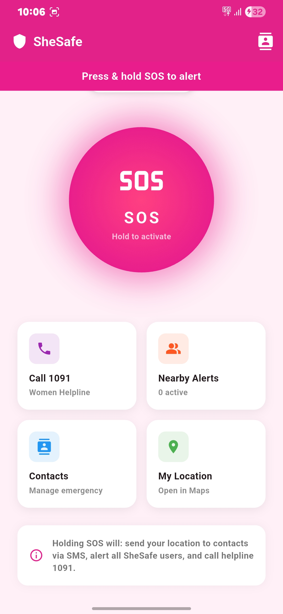
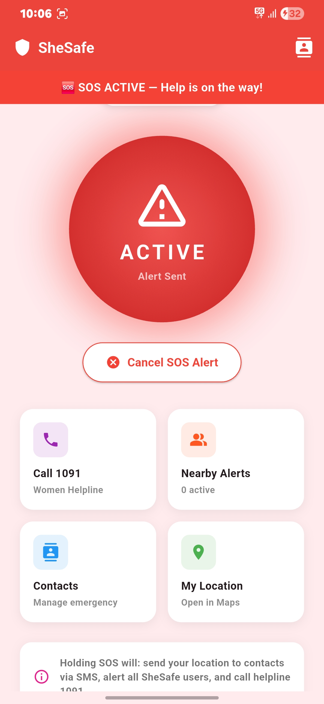
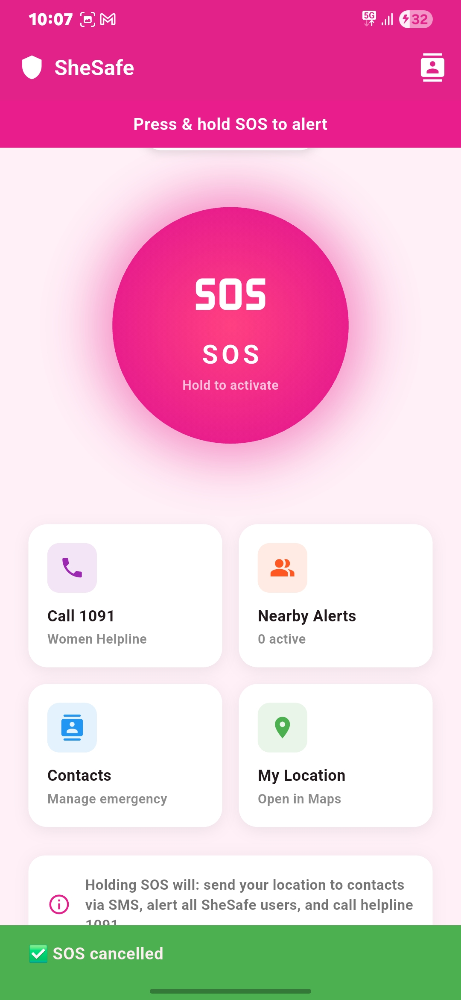

# SheSafe – Women Safety SOS App

A cross-platform women's safety app built with **Flutter** and **Firebase**. With a single press-and-hold, SheSafe sends the user's live location to trusted contacts by SMS, alerts nearby SheSafe users, and dials the women's helpline (1091).

[**Download the Android APK**](https://drive.google.com/file/d/1heP5MyXDLddI9PouGHkU2hwVtPrByG0z/view?usp=sharing)

> To install: download the APK, open it on your Android phone and allow "Install from unknown sources" when prompted.

## Screenshots

| Home | SOS active | SOS cancelled |
|:---:|:---:|:---:|
|  |  |  |

## Features

- **Press-and-hold SOS**: a deliberate long press avoids accidental triggers, with haptic feedback on activation.
- **Instant multi-channel alert**: on activation the app
  1. broadcasts the alert and live location to Firebase,
  2. sends a push notification (FCM) to other SheSafe users,
  3. texts a Google Maps location link to the user's emergency contacts,
  4. calls the Women's Helpline **1091**.
- **Cancel anytime**: one tap cancels the alert and withdraws it from nearby users.
- **Live location updates**: the position is refreshed every 10 seconds while an SOS is active.
- **Nearby alerts**: see active SOS alerts around you (auto-refreshing) and call for help or the helpline.
- **Emergency contacts**: add, edit and remove trusted contacts, stored on the device.
- **Safety Score (0–100)**: a weighted estimate of how safe your current situation is:
  - time of day (30%)
  - location risk via reverse geocoding (30%)
  - recent alerts nearby (40%)
- **My Location**: open your current position in Google Maps.
- First-run setup flow, splash screen and runtime permission handling.

## Tech stack

| Area | Technology |
|---|---|
| Framework | Flutter (Dart 3) |
| Backend | Firebase Cloud Firestore, Realtime Database, Cloud Messaging |
| Location | `geolocator` |
| Permissions | `permission_handler` |
| Notifications | `flutter_local_notifications`, `firebase_messaging` |
| Calls / SMS / Maps | `url_launcher` |
| Local storage | `shared_preferences` |

## Project structure

```
lib/
├── main.dart
├── models/                  # Data models (contacts, SOS alerts)
├── screens/                 # Splash, setup, home, contacts, nearby alerts
├── services/
│   ├── sos_service.dart             # Location, contacts, alert broadcast, SMS, call
│   ├── notification_service.dart    # Local and push notifications
│   └── safety_score_service.dart    # Safety score calculation
└── safety_score_widget.dart
```

## Run from source

Firebase configuration files are intentionally **not** committed (`lib/firebase_options.dart`, `android/app/google-services.json`), so you need your own Firebase project.

```bash
git clone https://github.com/NachiketAbhayVaidya/SOS.git
cd SOS
flutter pub get
dart pub global activate flutterfire_cli
flutterfire configure     # generates firebase_options.dart for your project
flutter run
```

Build a release APK with `flutter build apk --release`.

## Author

**Nachiket Vaidya**
